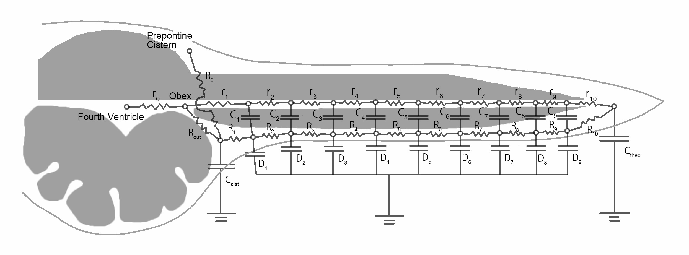
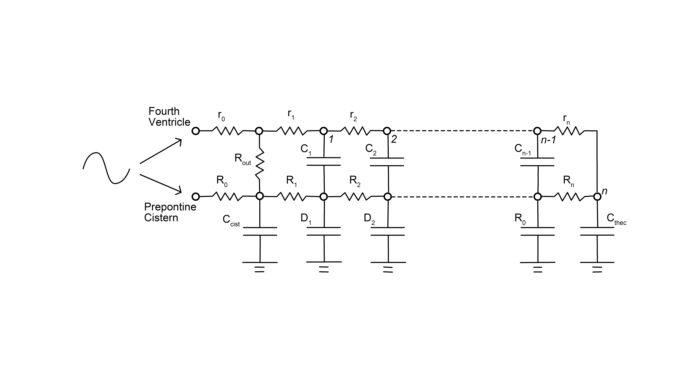
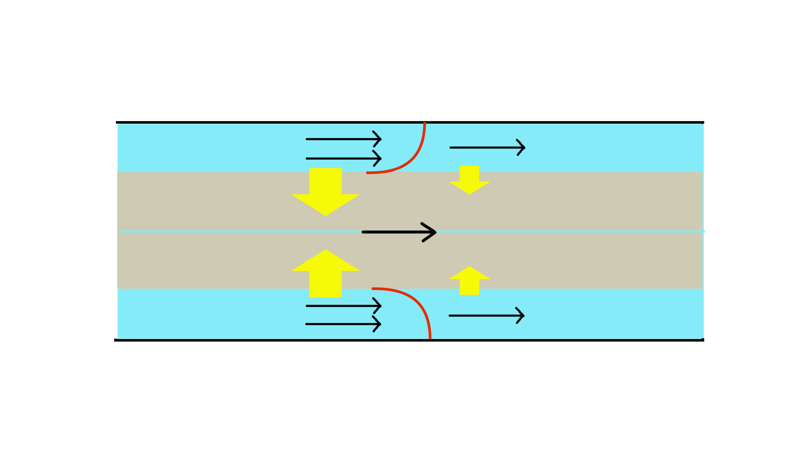
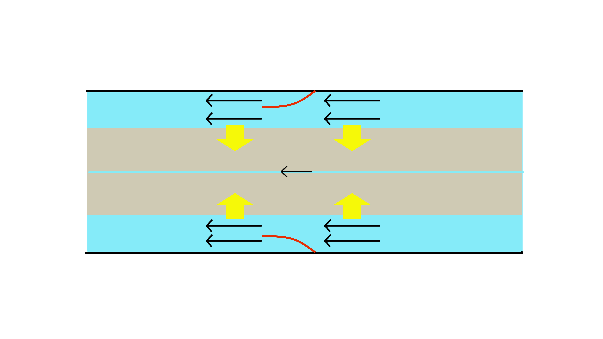

# Introduction {#introduction .unnumbered}

The pathophysiology of syringomyelia is still poorly understood. Many hypotheses exist in the literature[@gardner1958mechanism; @williams1980pathogenesis; @milhorat1999chiari; @ball1972pathogenesis; @klekamp2002pathophysiology; @duboulay1974mechanism; @heiss1999elucidating; @milhorat1993anatomical; @stoodley2000pathophysiology; @terae1994increased; @chang2003hypothesis; @chang2004theoretical; @greitz2006unraveling], but they provide widely different explanations on the mechanisms of syrinx generation. There are, however, a few consensuses. First, the syrinx fluid is identical to the CSF, and there is some communication between the syrinx and the subarachnoid space. This point is supported by many studies[@ellertsson1969syringomyelia; @ellertsson1969myelocystographic; @li1987conventional; @heiss2019origin], albeit some different opinions[@greitz2006unraveling; @koyanagi1997surgical]. Second, some derangement of CSF flow in the spinal subarachnoid space causes syrinx both in Chiari-I malformation[@wolpert1994chiari; @bhadelia1995cerebrospinal; @heiss1999elucidating; @hofmann2000phasecontrast; @quigley2004cerebrospinal] and subarachnoid arachnopathy[@klekamp1997treatment; @brodbelt2003altered; @heiss2012pathophysiology; @chang2014dorsal]. Notably, the cerebellar tonsil deranges the CSF flow in the former and adhesive arachnoiditis in the latter.

The problem, however, is where this communicating channel resides and what mechanism generates the syrinx. On these points, there is no solid experimental or clinical evidence, and the opinions of researchers vary widely. Gardner et al.[@gardner1958mechanism] thought that the central canal intercommunicates the syrinx and the fourth ventricle. Arterial pulses then exert pressure waves on the central canal and generate the syrinx. Williams et al. also postulated the communication through the central canal. He, however, emphasized the craniospinal pressure gradient produced by Valsalva maneuver et al.[@williams1980pathogenesis].

On the other hand, Ball and Dayan[@ball1972pathogenesis] assumed that CSF entered the syrinx through the perivascular space of arteries penetrating the spinal cord. This idea has the following variations. Heiss et al.[@heiss1999elucidating] proposed that the piston-like movement of the cerebellar tonsils in Chiari-I patients generated pressure waves in the spinal subarachnoid space. And it subsequently drove CSF into the syrinx through the perivascular space. Stoodley et al. also considered the perivascular space as the communicating channel, but he assumed the arterial pulse pressure as the driving force[@stoodley2000mechanisms]. All these assumptions are not proven and remain hypothetical. Although recent researchers seem to favor the perivascular-space theory, there remains the possibility that a thin communicating channel exists between the syrinx and the fourth ventricle[@chang2021hypothesis].

In our opinion, the main theoretical problems reside in the following points.

1.  No theory can explain the pathophysiological mechanism of syringomyelia in a unified fashion.

2.  No theory can explain how CSF enters from the low-pressure subarachnoid space to the high-pressure syrinx cavity and remains inside.

As to the first point, there are different syringomyelia types, such as Chiari-I-malformation and spinal-arachnopathy-related[@klekamp1997treatment]. The Chiari-I-malformation-related syringomyelia is further divided into communicating and non-communicating[@elliott2013syringomyelia]. Current theories cannot explain these different types of syringomyelia in a unified fashion. However, it may be more natural to conjecture some common mechanism underlying these different types of syringomyelia[@stoodley2000mechanisms]. The second point is theoretically essential but challenging. Physical laws dictate that the expanded syrinx cavity has higher pressure than the subarachnoid space[@serwayr.a.2016fluids; @heiss1999elucidating; @davis1989mechanisms; @ellertsson1970distending]; the inside pressure must additionally confront the elastic tension of the syrinx wall. Therefore, merely assuming a communicating channel does not explain how CSF enters the syrinx against this pressure gradient and remains inside. Even if we take a specific time window where the subarachnoid pressure exceeds the syrinx pressure, it does not explain how the CSF remains inside the syrinx after it.

The current article is part of our effort to solve the above theoretical problems. We proposed in our previous paper[@chang2021hypothesis] a hypothesis on the pathophysiology of syringomyelia. We hypothesized that a direction-selective resistance to spinal subarachnoid CSF flow causes syringomyelia. Suppose there is a resistance to spinal CSF flow only in the, e.g., caudal direction. To-and-fro CSF movement across it will pump CSF in an intraspinal channel caudally, causing syringomyelia. This hypothesis seemed to solve the two problems listed above. However, in that article, we just drew a rough sketch of this process and left out a detailed explanation. The current article will describe this mechanism in detail using computer simulation.

For this purpose, we used a mathematical model simulating the CSF movement of the spine. We revised a lumped parameter model with multiple compartments used in our previous articles[@chang2003hypothesis; @chang2004theoretical]. We placed a direction-selective resistance in this model at a certain point in the spinal subarachnoid space. We then observed how it affected the CSF flow in the channel inside the spinal cord.

# Material and Method {#material-and-method .unnumbered}

There is a problem when we try to simulate the motion of biological fluids such as blood and CSF. Such bodily fluids move inside flexible tubes. It differs from the usual situation of fluid mechanics, where the boundary of the fluid conduit is solid. Thus, we cannot simply apply the standard Navier-Stokes equations for our simulation. For this reason, researchers have commonly used lumped parameter models[@shi2011review; @kokalari2013review]. This model considers the fluid flow inside a flexible tube analogous to the electric flow in an electric circuit. The accumulation of electricity in a capacitor represents the expansion of a flexible tube and the accompanying pressure elevation. An electrical resistor represents the frictional resistance to flow. This model has a wide variety. For example, it may model the whole cardiovascular system as one electric circuit, or it may model it as a synthesis of multiple compartments of electric circuits[@shi2011review; @kokalari2013review]. Our current model is the type of lumped parameter model with multiple compartments that simulates the CSF dynamics in the spine and is an updated version of the model used in our previous articles[@chang2003hypothesis; @chang2004theoretical]. We did not intend to make a quantitatively precise model of the spinal CSF flow but to make a basic model that could reveal the phenomenon underlying the generation of syringomyelia.

Previously, we developed a mathematical model that simulated the CSF flow in the spine[@chang2003hypothesis; @chang2004theoretical]. This model (a multiple-compartment version of a 1-dimensional lumped parameter model) could describe the CSF movement in the whole spine (Figure [1](#fig:model){reference-type="ref" reference="fig:model"}). This model assumed an intraspinal CSF channel---the central canal or some other equivalent channel. In this model, the *D* capacitors represented the dural tension, *C* capacitors the tension of the central canal, *R* resistors the frictional resistance in the subarachnoid space, and *r* resistors the frictional resistance in the central canal.

{#fig:model width="\\textwidth"}

Figure [2](#fig:circuit){reference-type="ref" reference="fig:circuit"} shows the bare electric circuit extracted from Figure [1](#fig:model){reference-type="ref" reference="fig:model"}. A set of differential equations could describe the behavior of this model. Using computer software, we could numerically calculate its behavior in response to a certain cranial pressure wave (defined as a boundary condition on the cranial nodes). The concrete parameters were determined as follows.

-   We increased the number of compartments from 10 to 100, thereby
    making the model more precise.

-   We set the length of the modeled spinal cord to be 1 meter.

-   The resistance of the subarachnoid space ($R$) was estimated using the following equations of Poisseuille[@brook1999numerical; @sherwin2003computational; @huilgol2020fast].

    $$\Delta P=\frac{8\pi \mu{}LQ}{A^{2}}=RQ$$

    -   $\Delta P$: Pressure difference between the adjacent compartments

    -   Q: flow speed per unit surface

    -   $\mu$: viscosity coefficient. In this case, it was set to the value of water (0.0007).

    -   L: distance between the adjacent compartments. It was set to 1 cm.

    -   A: cross sectional area of the subarachnoid space. It was set to the value of a concentric annulus[@huilgol2020fast] with the outer diameter of 1cm and the inner diameter of 0.7 cm ($1.6\times{}10^{-4} (m^2)$)

    Thus, $R$ was calculated to be $6872\hspace{0.2cm}(Pa\cdot{}sec/m^3)$

-   The resistance of the central canal ($r$) was estimated using the same equation with $A$ set to $\pi{}(10^{-4})^2\hspace{0.1cm}(m^2)$, i.e. the cross sectional area of a tube with a diameter of 100 $\mu{}m$. Thus, $r$ was calculated to be $1.78\times10^{11}\hspace{0.2cm}(Pa\cdot{}sec/m^3)$

-   We determined the capacitance ($C_{sub}$)corresponding to the dural elasticity so that the pressure-wave velocity determined by the time constant ($RC$) will roughly correspond to the pressure-wave velocity of the downward CSF wave observed in phase-contrast MRI of normal individuals. Thus, we set $C_{sub}=0.1\hspace{0.2cm}(m^3/Pa\cdot{}sec)$.

Figure [1](#fig:model){reference-type="ref" reference="fig:model"} shows the scheme of the constructed electric circuit model. This model represents the CSF movement in the spine as electric flow through multiple compartments of capacitances connected with resistors. A set of differential equations can describe the behavior of this electric circuit, and we can solve it numerically by setting the voltage at the cranial nodes as the boundary condition (Figure [2](#fig:circuit){reference-type="ref" reference="fig:circuit"}). In the previous articles[@chang2003hypothesis; @chang2004theoretical], we only analyzed the transient behavior of the model to a sudden pressure increase on the cranial side of the subarachnoid space. This analysis helped simulate the situation of coughing or Valsalva maneuvers. In this article, however, we analyzed the response of the model to an oscillating cranial pressure wave simulating the normal cardiac pulsation of the CSF.

{#fig:circuit width="\\textwidth"}

We numerically solved the differential equations using computer software (Mathematica version 12, Wolfram Research, Champaign, IL, U.S.A.) on a personal computer. We set the boundary conditions as follows. (1) The voltage at the two cranial nodes was set to a sine wave oscillating around 10 $cmH_{2}O$ with an amplitude of 20 $cmH_{2}O$ at one cycle per second. (2) The initial dural pressure was set at 10 $cmH_{2}O$ in all segments. We set the step of the numerical solution to 1/5000 second and calculated the solution from zero to 20 seconds. The actual Mathematica codes can be found in our GitHub repository (<https://github.com/chang-hs/syrinx_simulation.git>).

We analyzed the original normal system and two of its modifications. In the first modification, we simply increased the subarachnoid resistance at point 25 ($R_{25}$) by 20 times. In the second modification, we placed a direction-selective subarachnoid resistance at point 25, so that only the resistance to the caudal flow would be increased by 20 times.

# Results {#results .unnumbered}

We present the systems' responses to twenty cycles of to-and-fro waves in animations. The x-axis of each animation represents the 100 nodes of the circuit laid out from the cranial to caudal direction. The y-axis displays some of the following four measures: the dural tension (voltage in D capacitors in Figure 2), the canal tension (voltages in C capacitors), the subarachnoid CSF flow (flows in R resistors), and the channel flow (flows in r resistors). We plotted the caudal flow in the positive and the rostral flow in the negative direction. The pressure values are shown in $cmH_2O$, the flows in $ml/sec$. To plot the four measures in a single animation, we multiplied the following three measures---the canal tension, the subarachnoid CSF flow, and the canal flow---with the following coefficients, respectively: namely, the canal tension with 50, the subarachnoid flow with 0.005, and the canal flow with $1.5\times10^{5}$.

Video 1 shows the original system's response representing the normal condition. In this state, the dural tension made a smooth gradient along the spine, whose polarity alternated along the pressure cycle. According to this pressure gradient, CSF made a smooth to-and-fro movement in the subarachnoid space with the corresponding pressure wave along the dura and the central canal. CSF also made smooth to-and-fro movements in the channel. There was almost no pressure elevation in the intra-spinal channel.

In Video 2, we increased the subarachnoid resistance $R_{25}$ by 20 times, thereby simulating a simple block of the subarachnoid flow in both directions. In this condition, both the caudal and rostral flow across the resistance produced pressure drop in the distal subarachnoid segment. This pressure drop caused an increase in canal flow in the same direction as the subarachnoid flow. This increased canal flow caused a transient increase in the canal pressure distal to the block and a decrease proximal to the block. However, these pressure changes alternated along the alternation of the flow direction and did not produce a sustained pressure increase.

In Video 3, we replaced the subarachnoid resistor $R_{25}$ with a direction-selective resistor whose resistance to the rostral flow was unchanged but that to the caudal flow was increased by 20 times. This time, sustained high pressure appeared in the intra-spinal channel in the segment distal to the replaced resistor, and sustained low pressure in the segment proximal to it. This sustained pressure gradually accumulated as the flow cycle proceeded. The dural tension showed a pressure drop at node 25 only during the caudal-flow phase. The to-and-fro canal flow increased near the node 25 similarly to that in the simple block above, but, this time, the increase was larger in the caudal direction.

We extracted the canal flow from this animation and showed it in Video 4. Observing this video, we can see that the cumulative total of the caudal flow is larger than that of the rostral flow, meaning that the CSF is virtually pumped caudally at node 25. To further elucidate this point, Video 4 simultaneously shows the canal flow in the simple block as shown in Video [\[video:simple_block\]](#video:simple_block){reference-type="ref"reference="video:simple_block"} and that in the one-way block as shown in Video [\[video:oneway\]](#video:oneway){reference-type="ref"reference="video:oneway"}. We can clearly see that the caudal flow is about the same in the two models, while the rostral flow is smaller in the direction-selective model. It means that CSF in the intra-spinal channel is pumped caudally in each cycle of the to-and-fro CSF movement.

# Discussion {#discussion .unnumbered}

In this article, we theoretically analyzed the CSF movement in the spine using a lumped parameter model with multiple compartments. It simulated a system with an elastic tube (dura) containing an elastic cylindrical material (spinal cord) that itself had a fluid channel inside. When we placed a direction-selective resistor in the subarachnoid space and evoked a to-and-fro pressure wave on this system, it produced a sustained pressure elevation in the segment distal to the resistor in the resisted direction. This phenomenon may explain the pathogenesis of syringomyelia both in Chiari I malformation and syringomyelia associated with arachnopathy.

Subarachnoid pressure pushes the spinal cord material and affects the pressure inside the intra-spinal channel. As seen in Figure [2](#fig:circuit){reference-type="ref" reference="fig:circuit"}, the absolute pressure inside the intra-spinal channel is the sum of the subarachnoid and channel tension (voltages of $C_k$ and $D_k$ in electrical terms). Suppose a one-way valve selectively resists caudal flow in the subarachnoid space at point $A$. Caudal CSF flow creates a pressure drop across point $A$, with the caudal pressure smaller than the proximal one. Thus, the absolute pressure in the canal distal to point $A$ become smaller because the outside subarachnoid pressure there is smaller. It, therefore, creates a pressure gradient in the central canal across point $A$, thereby increasing the distal CSF flow in the canal at that point (Figure [3](#fig:pump_close){reference-type="ref"reference="fig:pump_close"}).

{#fig:pump_close width="\\textwidth"}

On the contrary, rostral flow, not encountering resistance, does not create a pressure drop (Figure [4](#fig:pump_open){reference-type="ref"reference="fig:pump_open"}). Although some of the CSF that had been pumped caudally during the caudal-flow phase will flow back rostrally, its amount will be smaller. The net result will be that some CSF is pumped caudally in one cycle of the to-and-fro movement. Thus, CSF gradually accumulates in the distal segment of the resistance (Video 3). We hypothesize that this is the mechanism underlying the syrinx generation.

{#fig:pump_open width="\\textwidth"}

Our theory clearly explained how the CSF is paradoxically driven into the high-pressure syrinx and retained inside against the pressure gradient. In the direction-selective resistance model, the caudal segment of the intra-spinal channel has sustained higher pressure than the subarachnoid space. However, the energy of to-and-fro CSF movement creates alternating pressure gradient in the rostro-caudal direction. Because this rostro-caudal pressure gradient is larger than the sustained high pressure of the intra-spinal channel, CSF flows into the caudal segment from the rostral side during the caudal flow phase (Figure[@fig:pump_close]). In the rostral flow phase, the rostro-caudal pressure gradient is reversed in direction; the pressure on the rostral side becomes smaller than that on the caudal side. CSF flows out rostrally from the caudal intra-spinal channel; however, because the pressure-drop effect caused by the subarachnoid resistance is absent in this phase, the rostro-caudal pressure gradient in the intra-spinal channel is smaller and the rostral CSF flow is smaller than that during the caudal flow phase (Figure[@fig:pump_open]). We believe that this is the mechanism of the apparently paradoxical behavior of the CSF in syringomyelia.

Direction-selective resistance to CSF flow is not an imaginative assumption. In Chiari-I malformation, the herniated tonsils move like a ball-valve; they are displaced caudally during the caudal flow and rostrally during the rostral flow. The higher velocity observed in the phase-contrast MRI studies suggests that they selectively impede the caudal CSF flow more than the cranial flow. Williams et al. demonstrated direction-selective resistance at the craniovertebral junction of Chiari-I patients, which became the basis of his theory[@williams1981simultaneous]. Also, some types of arachnoid pathology may function as one-way valves. In 2014, we reported cases of thoracic arachnoid web associated with syringomyelia, in which phase-contrast MRI demonstrated one-way-valve-like behavior of the arachnoid web[@chang2014dorsal]. In surgery, we found an obliquely oriented arachnoid web that resembled a one-way valve. Thus, our hypothesis may also solve the second theoretical problem we pointed out in the Introduction. Namely, the direction-selective resistance in spinal subarachnoid space may function as the common mechanism underlying both Chiari-I-related and arachnopathy-related syringomyelia.

transformed into the energy-requiring trasport of CSF into the syrinx.
However, previous theories seemed to have difficulty in explaining this
process. According to the theories of Heiss et
al.[@heiss1999elucidating] or that of Stoodley et
al.[@stoodley2000mechanisms], the energy is provided by either enhanced
pressure waves in subarachnoid space or pulsation of spinal arteries.
However, none of these theories explains the detailed mechanism

Our results may cast some light on another interesting question. In cervical spondylosis, subarachnoid space is similarly obliterated by the protruding discs and osteophytes. Although this is a widely prevaent disease, we rarely encounter syringomyelia associated with cervical spondylosis. In our results, a simple block of the subarachnoid CSF flow did not produce sustained elevation of intraspinal channel pressure (Video 2). This result may explain why syringomyelia is rarely associated with cervical spondylosis.

There are some controversial points in our theory. Our model presumed the existence of a CSF channel inside the spinal cord. It may be controversial because most syringes seem to lack such communication. Yet, there still may exist a narrow CSF channel that is undetectable on MRI. In fact, ordinary MRI does not visualize the central canal with a diameter of 100 micrometers. Therefore, assuming the existence of a CSF channel inside the cord will not be far-fetched. Another point of controversy will be the role of the central canal. The human central canal is obstructed with advancing age, and assuming a function of the central canal may not befit that fact. However, the obliteration of the central canal seem to be a slow process, and it could be mostly patent up to the fourth decade[@newman1981observations; @yasui1999agerelated]. Moreover, the CSF channel does not have to be the central canal but some other channel created inside the spinal cord matrix.
